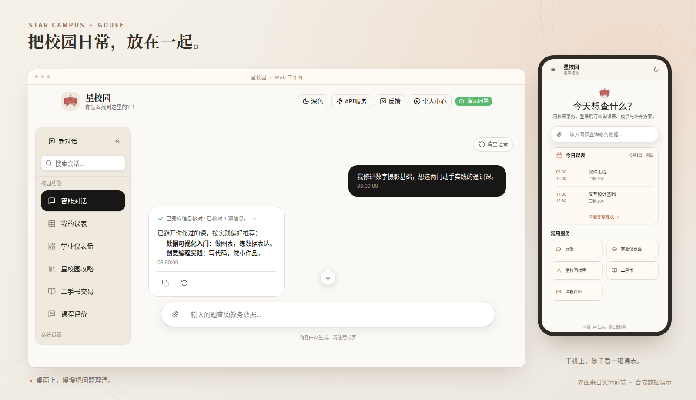

<picture>
  <source media="(prefers-color-scheme: dark)" srcset="assets/header-dark.svg" />
  
</picture>

[个人博客](https://blog.utopiacd.online) · [星校园](https://gdufe-agent.utopiacd.online)

### 星校园 · GDUFE Campus Agent

给广财同学做的校园助手。课表、成绩、学业进度，校园问答等.....

有 Web 和微信小程序。源码私有，欢迎[体验！](https://gdufe-agent.utopiacd.online)

### 还有几个项目

- [校园工具箱](https://github.com/cd233ljx/gdufe-campus-balance) — 水电余额监控、校园网自动登录与低额提醒。
- [微信桥接OpenAI Dot](https://github.com/cd233ljx/wechat-dot-bridge) — 将个人微信桥接至Dot 
- [CampusClaw](https://github.com/cd233ljx/CampusClaw-PPT) — 查教务、做规划，把结果记到飞书。
- [AgentBeacon](https://github.com/cd233ljx/agentbeacon) — 给 AI 编程助手做了一颗状态灯。

---

<picture>
  <source media="(prefers-color-scheme: dark)" srcset="https://raw.githubusercontent.com/cd233ljx/cd233ljx/output/github-snake-dark.svg" />
  
</picture>
